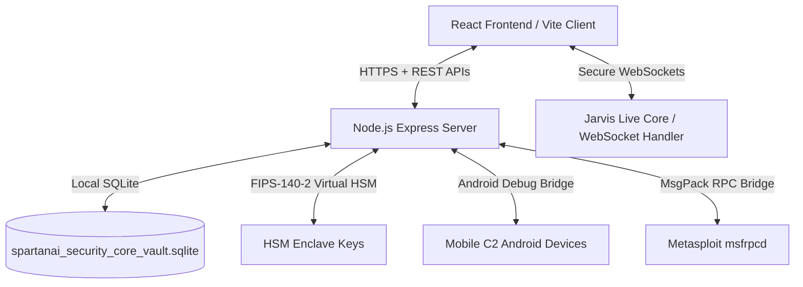

# SpartanAI Sovereign Security Suite (ASOC) - About and Deep Architecture

Welcome to the **SpartanAI Sovereign Security Suite (ASOC)**, a next-generation Autonomous Security Operations Center engineered for high-stakes defensive and offensive operations. This document provides a highly detailed overview of the system's philosophy, architecture, telemetry indicators, security mechanisms, and design decisions.

---

## 1. Executive Summary

SpartanAI represents a paradigm shift in security orchestration. Conventional platforms treat artificial intelligence as a static assistant or side-panel chatbot. SpartanAI instead positions the AI (**Jarvis**) as the **Root Operator** of the security enclave. Equipped with system interfaces, a hardware security module (HSM) simulator, direct Metasploit RPC integration, and a mobile cellular C2 bridge via Android Debug Bridge (ADB), Jarvis is capable of responding to real-time security events in milliseconds—bypassing traditional human-in-the-loop bottlenecks during critical containment phases.

---

## 2. Core Architectural Pillars

The application is structured as a single-page React client backed by a secure Node.js Express server. Communication is split between standard REST endpoints (utilizing JSON payloads and Bearer JWT tokens) and a bi-directional WebSocket interface used for sub-second streaming audio and command telemetry.

### A. The Neural Core (Jarvis)
Powered by the Google Gemini API, Jarvis operates as an autonomous agent. When security thresholds are breached:
1. The Intrusion Detection System (IDS) registers telemetry anomalies (e.g., suspicious shell execution or SSH brute-force attempts).
2. The IDS telemetry is ingested by Jarvis.
3. If threat severity registers as **Critical**, Jarvis automatically initiates self-directed countermeasures, such as creating exploit proposals, spinning up a local containerized firewall, or triggering host isolation.

### B. Sovereign Operational Enclave & The Vault
A zero-trust administrative interface that handles system secrets, user metadata, and credential stores.
- **SQLite Database (`spartanai_security_core_vault.sqlite`)**: Replaces transient in-memory storage with persistent tables for credentials, audit logs, remote nodes, and SSH configurations.
- **AES-256-GCM Encryption**: High-value parameters (such as private keys and access credentials) are encrypted at rest using Galois/Counter Mode.
- **WebAuthn (FIDO2) / Sovereign Mode**: Root operators can bypass standard database authentication entirely by utilizing hardware security tokens (e.g., YubiKeys) for cryptographic identity validation.

### C. Metasploit RPC Bridge
The suite establishes an authenticated MsgPack connection with `msfrpcd` (default port `55553`). 
- **Auto-Sync Engine**: The backend runs a background cron job (`msf-updater.ts`) to pull the latest vulnerability databases and signatures.
- **Remote Console**: An interactive terminal emulator in the UI allows operators to execute native MSF commands (such as `use exploit/multi/handler`, `set RHOSTS`, and `run`) directly from the Web Console.

### D. Hardened Android ADB Controller
Designed to interface with mobile C2 nodes over USB or local network tunnels.
- **Wireless Provisioning**: Converts standard USB-connected Android devices into wireless debug targets.
- **Ghost Routing VPN**: Packages and deploys custom OpenVPN profiles onto target handsets.
- **Silent APK Extraction**: Downloads and decompiles application packages for inspection directly through the browser.

---

## 3. The Holographic Dashboard

The suite features an immersive, cyber-tactical interface styled with glassmorphic aesthetics, neon highlights, and real-time state visualization.

### A. Dynamic Threat-Level Styling
The primary theme color, edge glows, and pulsing animations dynamically react to the system threat level:

| Threat Level | Primary Color | Pulse Speed | Glow Effect | Rationale |
| :--- | :--- | :--- | :--- | :--- |
| **Low** | `#06b6d4` (Cyan) | `8s` cycle | Subtle, steady | normal operation state |
| **Medium** | `#f59e0b` (Amber) | `4s` cycle | Moderate | warning state, active scans in progress |
| **High / Critical** | `#ef4444` (Red) | `1.5s` cycle | Intense, pulsing | critical breach, active countermeasures |

### B. Circular SVG Gauges
Three real-time status gauges monitor the system's operational parameters using animated SVG stroke-dasharray properties:
- **Shield Integrity**: Monitors the health and encryption state of the security enclave.
- **Threat Index**: Tracks the aggregate risk score compiled by the IDS scanner.
- **Network Entropy**: Evaluates noise and potential exfiltration anomalies on the network interface.

### C. Interactive Output Terminals & Holographic Controllers
- **SpartanAI_Security_Core Shell**: An interactive terminal interface that maps commands directly to backend scripts (e.g., `probe network`, `sync hsm`, `purge vault`, `status`). 
- **Holographic Control Hub**: Real-time toggles for:
  - **Decoy Matrix (Honeypot)**: Spins up fake SSH/Web services to divert scanning scripts.
  - **Intrusion IDS**: Enables/disables the deep packet signature inspector.
  - **Auto-Countermeasures**: Authorizes Jarvis to execute retaliatory exploits.
  - **Enclave Hardening**: Locks down vault folders and requires two-factor validation for any outbound files.

---

## 4. Verification & Testing

SpartanAI uses Playwright for End-to-End (E2E) verification:
- **Port Mapping**: The application utilizes port `3001` to avoid port conflict with agent background daemons.
- **Automated Tests**:
  - `Standard Login Flow`: Verifies operator credentials and dashboard redirects.
  - `Master Mode UI`: Tests hardware key registration hooks and toggle workflows.
  - `Dashboard and Threat Alerts`: Validates the existence of SVG gauges, toggle switches, and the interactive SpartanAI_Security_Core Shell.

All changes are continuously validated using local test frameworks to ensure absolute reliability in deployment.
